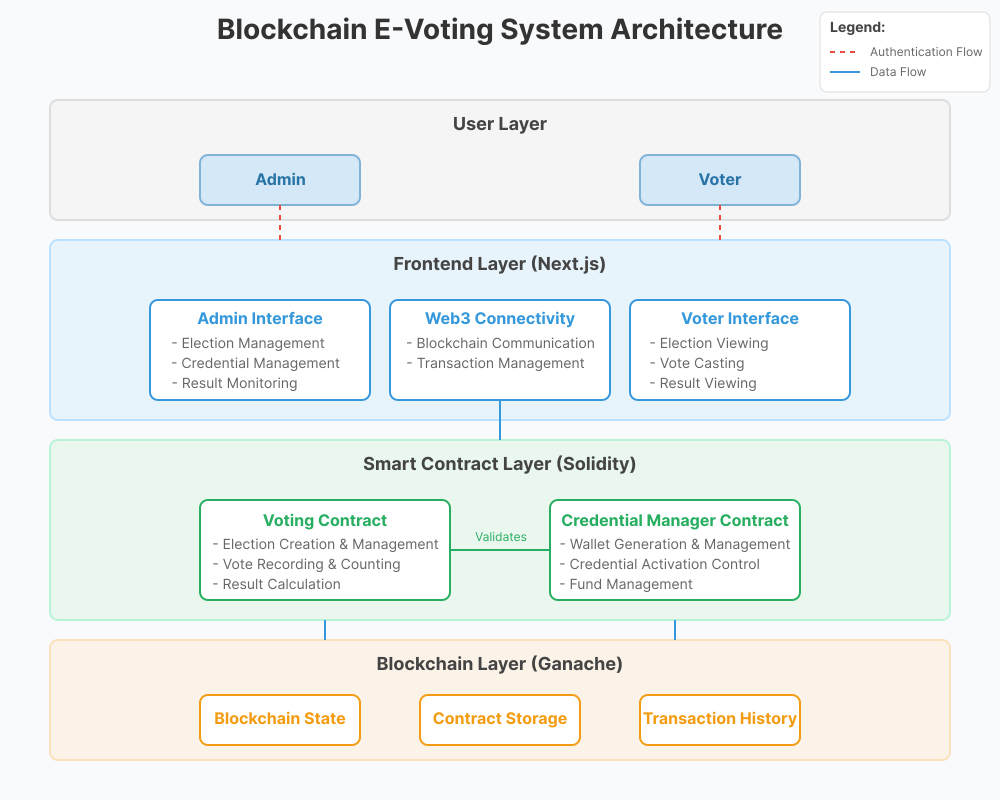

# Blockchain E-Voting System Developer Guide

## Project Overview

This project implements a secure, transparent e-voting system using blockchain technology. The system consists of three main components:

1. **Blockchain Layer** (Ganache): Provides an Ethereum blockchain for immutable storage of votes
2. **Smart Contract Layer** (Solidity/Truffle): Contains the business logic for elections and voting
3. **Frontend Layer** (Next.js): User interface for voters and administrators

The system allows for the creation and management of multiple elections, secure voter authentication via blockchain wallets, transparent vote counting, and real-time analytics.

## System Architecture



### Key Components:

1. **Ganache Blockchain**
   - Local Ethereum blockchain for development/testing
   - Stores all transaction data immutably
   - Uses port 8545 for API access

2. **Smart Contracts**
   - `Voting.sol`: Manages elections, candidates, and votes
   - `CredentialManager.sol`: Manages voter wallets and credentials
   - Deployed and managed via Truffle framework

3. **Next.js Frontend**
   - React-based user interface
   - Web3.js for blockchain interaction
   - Real-time vote visualization with Recharts

4. **Docker Infrastructure**
   - Containerized deployment for consistent environment
   - Docker Compose for orchestration
   - Shared volumes for contract artifacts

## Getting Started

### Prerequisites

- [Docker](https://www.docker.com/get-started) and Docker Compose
- [Node.js](https://nodejs.org/) (for local development outside Docker)
- [MetaMask](https://metamask.io/) browser extension

### Initial Setup

1. Clone the repository:
   ```bash
   git clone https://github.com/StilinskiAnas/E-Voting.git
   cd E-Voting
   ```

2. Make the reset script executable:
   ```bash
   chmod +x reset-blockchain.sh
   ```

3. Start the system fresh:
   ```bash
   ./reset-blockchain.sh
   ```

   This script will:
   - Stop any running containers
   - Remove volumes to ensure a clean blockchain state
   - Rebuild and start all containers

## Running the System

### Starting the System

```bash
docker compose up
```

### Resetting the Blockchain

To completely reset the blockchain state (useful for testing or when state becomes corrupted):

```bash
./reset-blockchain.sh
```

### Accessing the Application

- **Frontend**: [http://localhost:3000](http://localhost:3000)

### MetaMask Configuration

1. Install the MetaMask browser extension
2. Import the admin wallet using this private key:
   ```
   0xc87509a1c067bbde78beb793e6fa76530b6382a4c0241e5e4a9ec0a0f44dc0d3
   ```
3. Add a new network with these settings:
   - Network Name: Local Blockchain
   - RPC URL: http://localhost:8545
   - Chain ID: 1337
   - Currency Symbol: ETH

**Note:** Keep the admin wallet's private key secure and do not share it publicly. This wallet has administrative privileges in the e-voting system.

## Code Structure

```
e-voting-system/
├── blockchain/               # Ganache blockchain configuration
│   └── Dockerfile
├── contracts/                # Smart contracts
│   ├── Voting.sol            # Main voting contract
│   ├── CredentialManager.sol # Credential management contract
│   ├── Dockerfile
│   └── Migrations.sol
├── migrations/               # Truffle migration scripts
│   ├── 1_initial_migration.js
│   ├── 2_deploy_voting.js
│   ├── 3_deploy_credential_manager.js
│   └── 4_link_contracts.js
├── frontend/                 # Next.js frontend application
│   ├── public/
│   ├── src/
│   │   ├── components/       # Reusable UI components
│   │   ├── pages/            # Next.js page components
│   │   │   ├── admin/        # Admin-only pages
│   │   │   ├── elections/    # Election-related pages
│   │   │   ├── explorer.js   # Blockchain explorer
│   │   │   ├── index.js      # Home page
│   │   │   └── _app.js       # Next.js app wrapper
│   │   ├── styles/           # CSS modules
│   │   └── utils/            # Helper functions
│   │       ├── web3.js       # Web3 initialization
│   │       └── credentials.js # Credential management utilities
│   ├── Dockerfile
│   └── package.json
├── test/                     # Smart contract tests
│   └── voting.js
├── docker-compose.yml        # Docker Compose configuration
├── package.json
├── reset-blockchain.sh       # Reset script
└── truffle-config.js         # Truffle configuration
```

## Understanding the Smart Contracts

### Voting.sol

The Voting contract manages elections, candidates, and the voting process.

Key functions:
- `createElection()`: Create a new election
- `addCandidate()`: Add a candidate to an election
- `startElection()`: Start an election
- `endElection()`: End an election
- `vote()`: Cast a vote for a candidate

### CredentialManager.sol

The CredentialManager contract manages voter credentials and wallet access.

Key functions:
- `createCredential()`: Register a new voter wallet
- `createCredentialsBatch()`: Create multiple credentials at once
- `updateCredentialStatus()`: Activate or deactivate a credential
- `addFunds()`: Add ETH to a voter wallet
- `isActiveCredential()`: Check if a wallet is authorized to vote

## Contribution Guidelines

### Setting Up Development Environment

1. Fork the repository
2. Clone your fork:
   ```bash
   git clone https://github.com/StilinskiAnas/E-Voting.git
   ```
3. Create a feature branch:
   ```bash
   git checkout -b feature/your-feature-name
   ```

### Code Style

- **Solidity**: Follow [Solidity Style Guide](https://docs.soliditylang.org/en/latest/style-guide.html)
- **JavaScript/React**: Follow [Airbnb JavaScript Style Guide](https://github.com/airbnb/javascript)
- Use meaningful variable and function names
- Add comments for complex logic
- Keep functions small and focused

### Testing

- Write tests for any new functionality
- Run existing tests before submitting a PR:
  ```bash
  docker exec -it evoting-truffle truffle test
  ```

### Pull Request Process

1. Update documentation to reflect changes
2. Run tests to ensure functionality works
3. Submit a PR with a clear description of changes
4. Address any review comments

## Advanced Features

### Election Management

Administrators can:
- Create multiple elections
- Add candidates to elections
- Set start and end times
- Monitor results in real-time

### Credential Management

Administrators can:
- Create voter credentials (single or batch)
- Activate/deactivate voter access
- Fund voter wallets with ETH
- Export credential data

### Voter Features

Voters can:
- View active elections
- Cast votes securely
- See real-time results
- Verify their votes on the blockchain

## Security Considerations

### Smart Contract Security

- Avoid common vulnerabilities (reentrancy, overflow)
- Use function modifiers for access control
- Implement proper time checks for election phases

### Wallet Management

- Private keys must be securely stored
- Use hardware wallets for production environments
- Never commit private keys to version control

### Voter Privacy

- The system ensures vote secrecy by design
- Wallet addresses are not linked to voter identities
- Only the voter knows which wallet they control

## Troubleshooting

### Common Issues

1. **"Internal JSON-RPC error"**
   - This often indicates a gas issue or contract state problem
   - Try running `./reset-blockchain.sh` to start fresh

2. **MetaMask not connecting**
   - Ensure network settings are correct
   - Reset MetaMask account (Settings > Advanced > Reset Account)

3. **Missing contract artifacts**
   - Ensure volumes are properly mounted in docker-compose.yml
   - Rebuild the truffle container: `docker compose build truffle`

4. **Frontend not loading**
   - Check browser console for errors
   - Ensure all dependencies are installed: `docker compose build frontend`

## Performance Optimization

### Blockchain Optimization

- Batch operations where possible
- Minimize on-chain storage
- Use events for logging and frontend updates

### Frontend Optimization

- Implement pagination for large data sets
- Use memoization for expensive calculations
- Optimize React re-renders with proper component structure

## License

This project is licensed under the MIT License - see the LICENSE file for details.

---

By following this guide, you should be able to understand, use, and contribute to the Blockchain E-Voting System effectively.